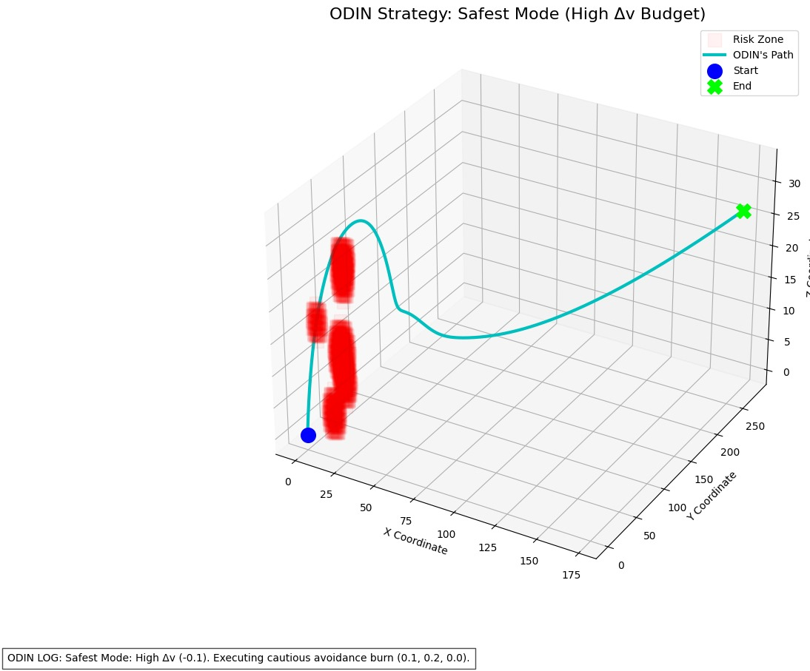
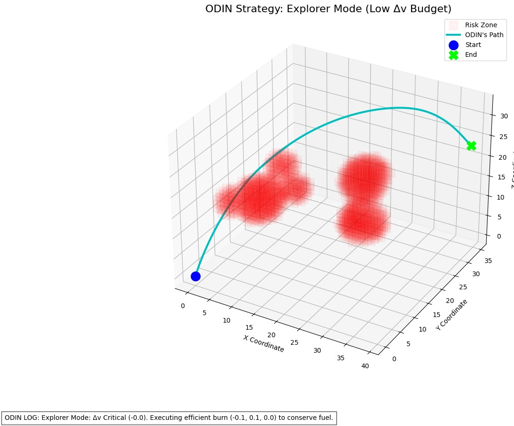
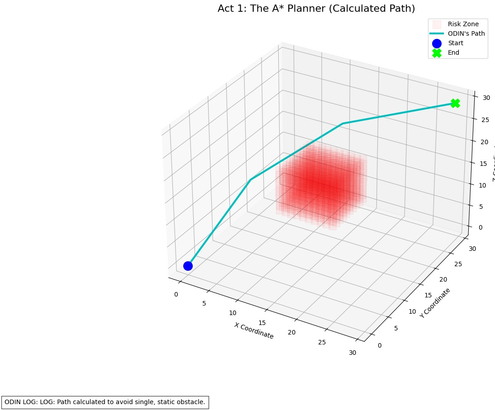
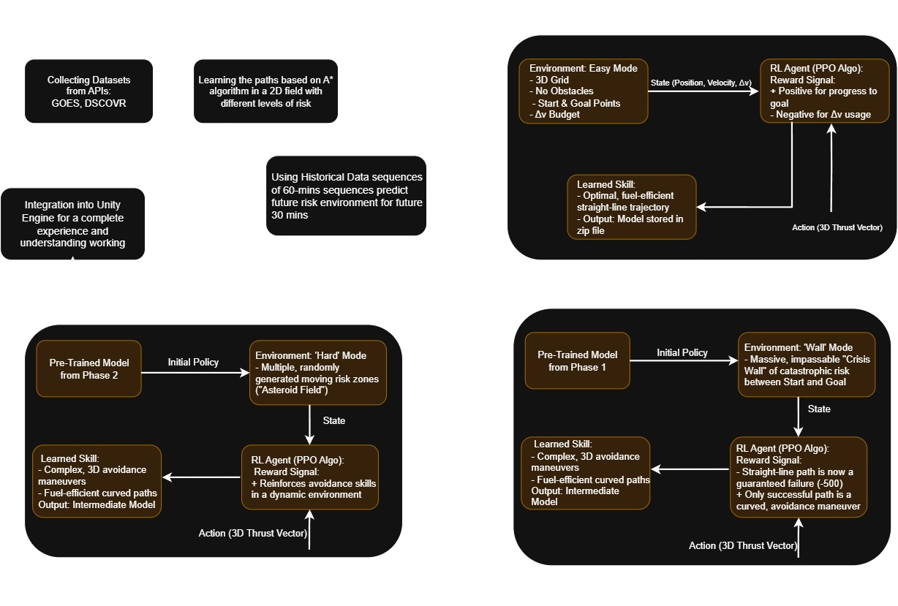
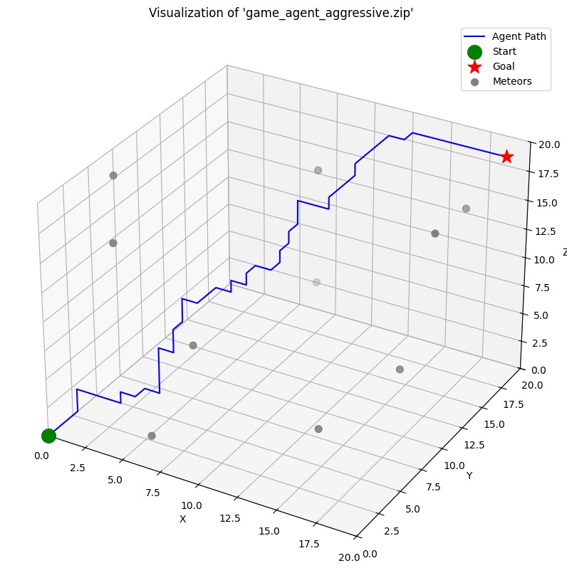
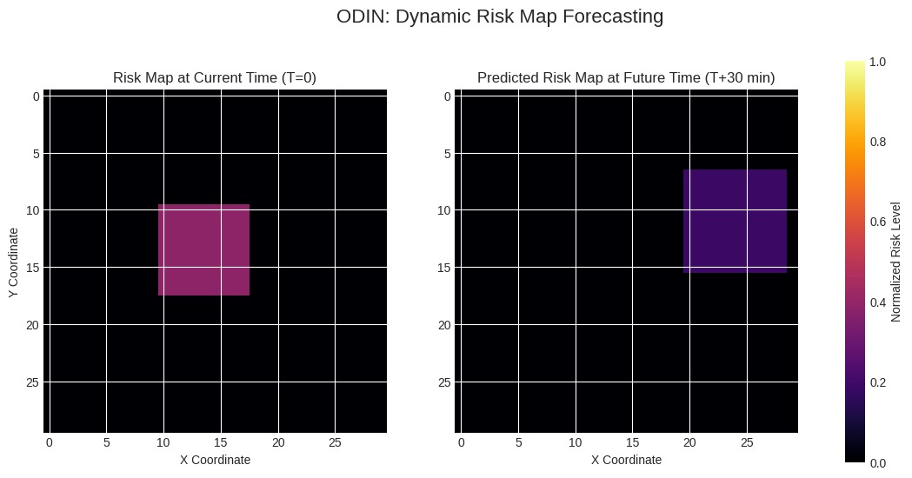
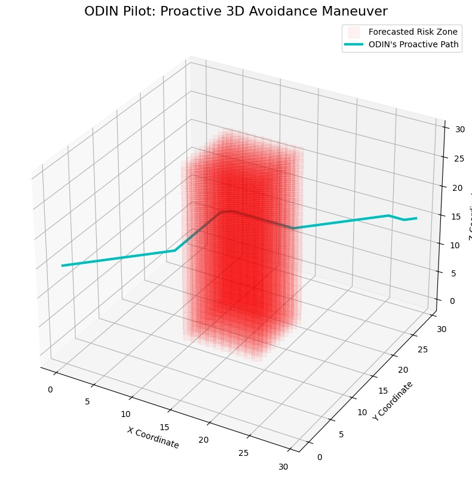
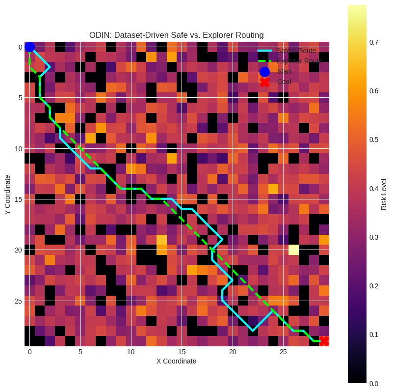
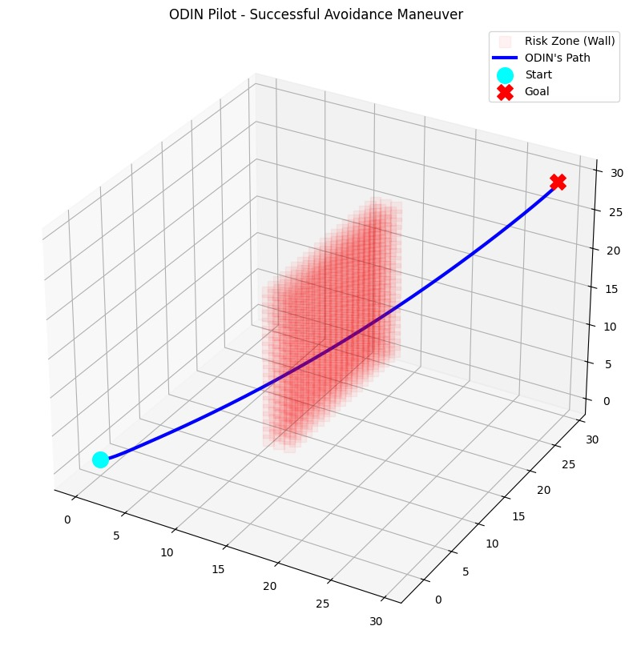
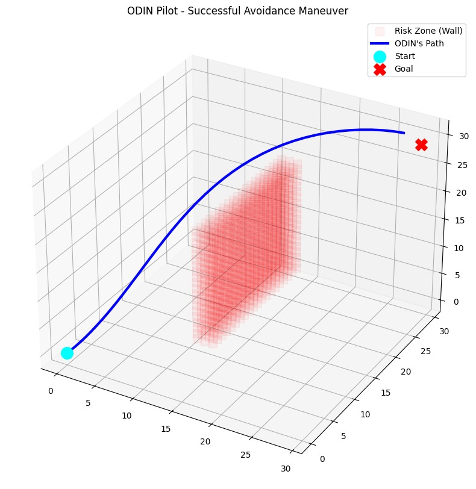

# AEGIS
##  Overview

AEGIS is an innovative Unity-based space game that demonstrates advanced artificial intelligence through reinforcement learning. The project features autonomous spacecraft navigation using ONNX models derived from custom-trained RL algorithms, showcasing real-time space weather data integration, dynamic pathfinding, and intelligent decision-making systems.

### Training Pipeline

The RL models are trained using **PPO (Proximal Policy Optimization)** with curriculum learning:

```python
# Curriculum Stages
1. Easy Mode: No obstacles, basic navigation
2. Medium Mode: Static obstacles, moderate complexity  
3. Hard Mode: Dynamic obstacles, crisis scenarios
```
### Model Architecture

## Model Visualizations

This section showcases the visual representations and architecture diagrams of our AI models:

---

### Training Progress & Performance Metrics
  
*Shows ODIN executing a safe but fuel-heavy avoidance maneuver around a dense risk zone.*

  
*Depicts ODIN conserving fuel by taking a riskier but efficient trajectory.*

  
*Demonstrates basic A* algorithm navigating around a simple static hazard.*

---

### Model Architecture Diagrams

  
*High-level ODIN workflow showing multi-stage RL training and system components.*


*The model learns to make small maneuvers around the meteor objects.*

---

### ONNX Model Visualization
  
*Left: current risk map (T=0). Right: forecasted risk map (T+30 min), enabling proactive avoidance.*

  
*ODIN begins avoidance well before a hazard reaches its future predicted position.*

---

### Agent Behavior Examples
  
*Heatmap contrasting conservative vs. aggressive routing strategies.*

  
*ODIN agent performing a smooth, fuel-efficient avoidance path close to a wall hazard.*

  
*ODIN agent executing a wider, safer avoidance arc around the same hazard.*
